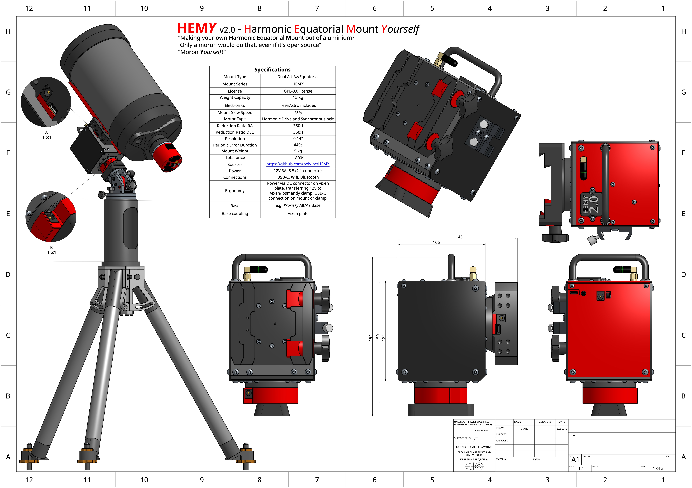
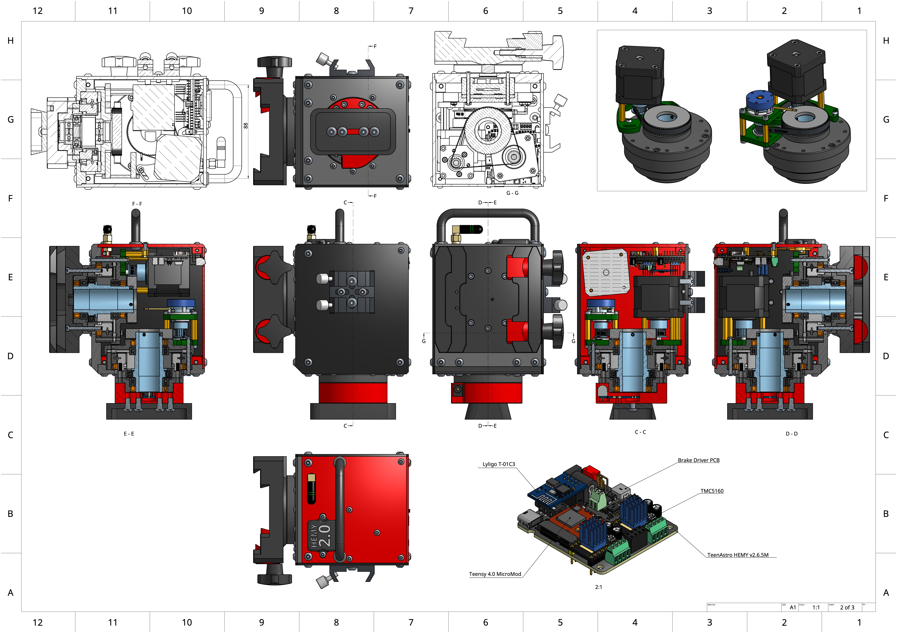
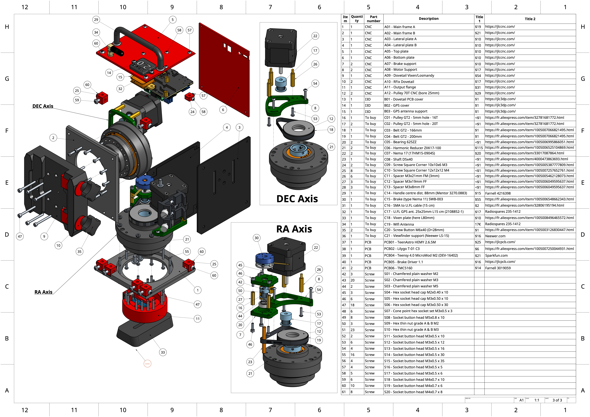
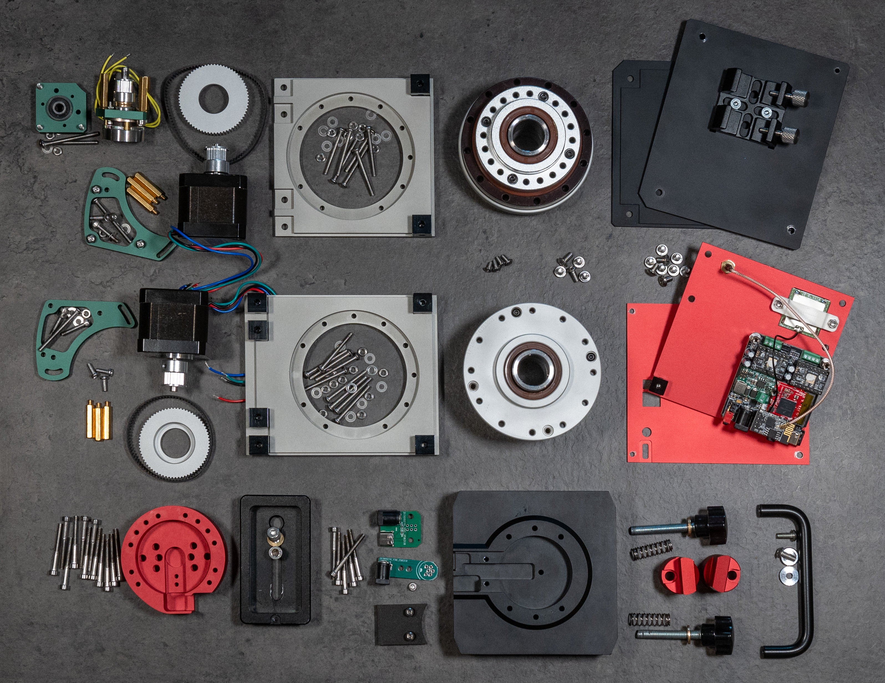

# ⚠️ WORK IN PROGRESS – Docs in Progress!
# HEMY v2 – Harmonic Equatorial Mount Yourself

> _"When astronomy meets DIY and open source, accessible tools are born to explore the universe."_  
> — polvinc

**HEMY v2** is an open-source equatorial/alt-azimuth telescope mount designed for passionate astrophotographers and visual observers. Built around **harmonic drive technology**, HEMY offers high precision, portability, and affordability — without compromising on performance.

It is the result of a collaborative and iterative development effort to deliver a powerful, modular alternative to proprietary commercial mounts.

---

## 🚀 Project Description

**HEMY (Harmonic Equatorial Mount Yourself)** is a DIY telescope mount based on industrial-grade **harmonic reducers**, typically used in robotics. These reducers enable compact, backlash-free motion with high torque — ideal for precise astronomical tracking.

The project was created to address key issues in amateur astronomy equipment:
- High prices of commercial mounts
- Lack of openness and flexibility
- Complexity or incompatibility with personal setups

HEMY is:
- 🧰 **Cost-effective** – Total build cost under **800–1000 €**, with machined parts available for less than 400 €
- 🪶 **Portable & lightweight** – Less than 4 kg without base
- 🏗️ **Easy to build** – Designed for makers with basic tools
- 💪 **High-performance** – Accurate tracking (sub-arcsecond RMS), no counterweights needed

⚠️ **Important note about current status** ⚠️

This project is under continuous development. Initial performance tests are promising (13 kg and guiding <1 arcsec) and updates will be published regularly.

---

## ✨ Key Features

| Feature                     | Description                                               |
|----------------------------|-----------------------------------------------------------|
| Mount Type                 | Equatorial / Alt-Az                                       |
| Technology                 | Harmonic drive + timing belts + NEMA17 motors     |
| Payload Capacity           | Up to **15 kg**, no counterweights                        |
| Resolution                 | ~0.14 arcsec                                              |
| Periodic Error             | ~440s cycle, ~±10 arcsec peak-to-peak                     |
| Controller Compatibility   | OnStepX, TeenAstro                                        |
| Connectivity               | USB-C, Wi-Fi, Bluetooth, integrated GPS                   |
| Features                   | RA axis brake, FRAM-based sensorless homing, 12V passthrough |
| Estimated Cost             | ~800–1000 € total                                         |
| Weight                     | < 4 kg (excluding base)                                   |
| License                    | **GPL-3.0**                                               |

---

## 🔧 Build Resources

- 🖥️ Full CAD files and STEP for mechanical parts  
- 🛠️ CNC-ready aluminum part kits (not available for now)  
- 📖 Detailed build guide and wiring instructions  
- 🧪 Currently tested and improved through real-world imaging

---

## 🧩 Related Projects

### [AstrAlim – Astro Controller & Power Hub](https://github.com/dgedgedge/AstraDIY)

Developed as a companion project to HEMY, **AstrAlim** is a fully open-source power and control hub for astrophotography sessions, built around a Raspberry Pi and custom HATs.

**Key Features**:
- Smart power distribution and current monitoring
- Built-in dew heater control (PWM outputs)
- GPS synchronization (PPS), USB/serial passthrough
- Open INDI compatibility, ready for automation scripts
- All for under ~200 €, as a DIY build

Together, **HEMY + AstrAlim** provide a complete open-source ecosystem for serious astrophotography, without breaking the bank — and with full user control at every step.

---

## 📜 License

This project is licensed under the **GNU General Public License v3.0 (GPL-3.0)**.  
Feel free to use, modify, improve, and share — just keep it open.

---

## 🙌 Credits and support

Made with curiosity, solder fumes, and a deep love for the stars.  
By [@polvinc](https://github.com/polvinc). Inspirations from the open-source astro community.

### Why Support?
The development of HEMY V2 represents thousands of hours of work, research, and development. The journey involved:
- Multiple prototypes and iterations
- Extensive testing and validation
- Many failed attempts that led to improvements
- Significant personal investment in components and materials
- Countless nights of testing under the stars

While HEMY is open-source and free to use, the development process has been costly. Each iteration required new parts, and the path to the current successful design involved many expensive learning experiences.

Hey! Help me out for a couple of :beers: !

---

## 🤝 Contributing

**Contributions are more than welcome!** Whether you're improving the documentation, proposing hardware tweaks, sharing your build, or contributing code – your help is greatly appreciated.

You can:
- Submit pull requests (PRs) for bug fixes, improvements, or new ideas
- Report issues or suggestions via GitHub Issues
- Participate in ongoing discussions

👉 A dedicated **[Discussions](https://github.com/polvinc/HEMY/discussions)** section is open for:
- Build logs and photos 📸  
- Tips and tricks 🔧  
- Questions, troubleshooting, and ideas 💬  
- Forks and derivatives 🚀

Let’s build a community of tinkerers, dreamers, and stargazers. Your input helps make HEMY better for everyone!

### Other Ways to Contribute
- Star the project on GitHub
- Share your build experiences and results
- Report bugs and suggest improvements
- Help improve documentation
- Share the project with other astronomy enthusiasts

Your support, whether financial or through contribution to the project, is greatly appreciated and helps keep this project alive and growing! 🚀✨

---

## Bill of Materials (BOM)

See [BOM.md](docs/v2/BOM.md).

### Total Estimated Cost: ~$800 without base

There are two possibilities for the alt/az base of the mount: either the HEMY v1 base, or the poxisky base which is very well sized for the project and less expensive.

Note: Prices are approximate and may vary depending on supplier and location.

---

## 🛠️ Assembly Guide

See [Assembly.md](docs/v2/Assembly.md).

The image below shows the complete set of mechanical and electronic parts required to build **HEMY v2**.

Each component has been carefully selected or designed to ensure high mechanical precision and ease of assembly. From CNC-machined aluminum plates and harmonic reducers to the stepper motors and controller board — this kit represents the full DNA of HEMY.

> Use this photo as a reference before you begin — for inventory, orientation, and inspiration.

---

### ✅ Pre-Assembly Checklist

Before getting started, make sure you have:

#### Tools
- [ ] Metric Allen (hex) key set  
- [ ] Phillips and flathead screwdrivers  
- [ ] Pliers and precision tweezers  
- [ ] Threadlocker (Loctite) — optional but recommended  
- [ ] Caliper or ruler  
- [ ] Soldering iron (if modifying electronics)

#### Workspace
- [ ] Clean, flat, well-lit surface  
- [ ] Small trays for sorting screws and components  
- [ ] Antistatic precautions for electronics  

#### Documentation
- [ ] This README and [detailed assembly docs](/docs/v2/Assembly.md)  
- [ ] Exploded views and diagrams (see `/drawings` folder)

---

<!-- 
### 🧱 Assembly Overview

Here’s the high-level assembly plan:

1. **🧩 Frame Assembly**  
   - Mount structural plates and base components  
   - Insert harmonic drives into RA and DEC sections  

2. **🔩 Motor Installation**  
   - Attach NEMA17 motors and pulleys  
   - Fit belts and adjust tension  

3. **⚙️ Axis Construction**  
   - Assemble RA and DEC units  
   - Install bearings, brake, and homing components  

4. **🔌 Electronics Setup**  
   - Mount controller (OnStepX or TeenAstro)  
   - Wire motors, GPS, and power distribution  
   - Connect USB, Wi-Fi, Bluetooth, and dew heater if applicable  

5. **🔭 Final Touches**  
   - Install dovetail clamp and polar finder bracket  
   - Route cables cleanly  
   - Power up, configure firmware, and start tracking! -->

See [Assembly.md](docs/v2/Assembly.md).

